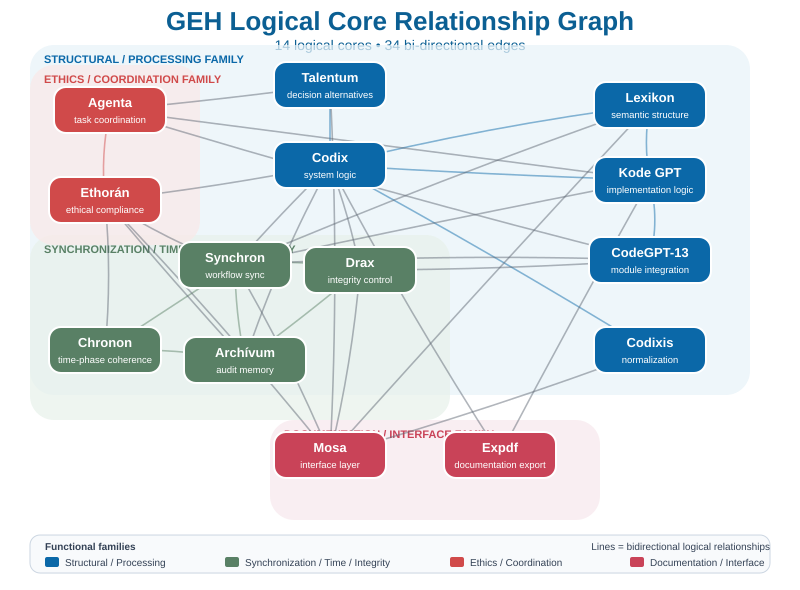

# GEH / AI Workflow & Validation Portfolio
## Public System Architecture and Relationship Overview

**Version:** 1.0  
**Date:** 2026-09-24  
**Status:** Public Architecture Overview  
**Operator:** Almási Andor

---

## 1. Purpose

This document summarises the publicly presentable system architecture of the GEH / AI Workflow & Validation Portfolio.

Its purpose is to enable an external developer, auditor or professional partner to quickly review:

- the functional role of the 14 logical cores;
- the 34-edge, bidirectional WIRE relationship graph;
- the 14×14 cross-validation principle of Multi Szimultán Szinkron (MSS);
- the separation of neural generation, external validation and human decision control;
- a possible black-box integration interface;
- and the validated and not-yet-benchmarked technical state.

This document is not an implementation specification. It does not contain the internal weights, threshold values, complete rule matrices, prompt structures or the know-how required to reproduce the system.

---

## 2. High-Level Architecture

One of the central principles of the system:

**neural generation ≠ external validation ≠ human decision**

The AI engines may produce candidate answers, analyses and solution directions.  
The external validation layer checks and compares these and, where necessary, sends them back for re-evaluation.  
Final decision control remains with the operator.



---

## 3. The 14 Logical Cores

In this document, “logical core” means a role-based logical and workflow function.

| Logical core | Short functional role |
|---|---|
| **Talentum** | decision alternatives and solution structures |
| **Codix** | system logic, structural and consistency examination |
| **Lexikon** | semantic and knowledge structures |
| **Codixis** | normalisation and boundary alignment |
| **Kode GPT** | implementation and transformation logic |
| **CodeGPT-13** | module assembly and integration |
| **Synchron** | state and workflow synchronisation |
| **Chronon** | temporal and phase coherence |
| **Drax** | integrity and protection control |
| **Archívum** | state, version, evidence and audit preservation |
| **Ethorán** | ethical and operational framework compliance |
| **Agenta** | task and workflow coordination |
| **Expdf** | documentation and export function |
| **Mosa** | interface, relational and presentation layer |

**Historical note:** Chronon appeared as a separate logical core in a later stage of the system's development, in close functional relationship with Synchron. It therefore does not always appear as a separate node in earlier graphs.

---

## 4. WIRE Relationship Graph

The later, verified system state:

- **14 logical cores**
- **34 unique, bidirectional edges**

The final degree of Codixis is **2**: it is connected to **Codix** and **Mosa**. The earlier “single connection” note originates from an outdated state.

<details>
<summary><strong>The 34 recorded bidirectional edges</strong></summary>

1. Talentum ↔ Codix  
2. Talentum ↔ Agenta  
3. Talentum ↔ Mosa  
4. Codix ↔ Lexikon  
5. Codix ↔ Codixis  
6. Codix ↔ Synchron  
7. Codix ↔ Drax  
8. Codix ↔ Archívum  
9. Codix ↔ Ethorán  
10. Codix ↔ Expdf  
11. Codix ↔ Kode GPT  
12. Lexikon ↔ Synchron  
13. Lexikon ↔ Mosa  
14. Lexikon ↔ Kode GPT  
15. Synchron ↔ Chronon  
16. Synchron ↔ Drax  
17. Synchron ↔ Archívum  
18. Synchron ↔ Ethorán  
19. Synchron ↔ Kode GPT  
20. Synchron ↔ CodeGPT-13  
21. Synchron ↔ Mosa  
22. Drax ↔ Archívum  
23. Drax ↔ CodeGPT-13  
24. Archívum ↔ Ethorán  
25. Archívum ↔ Chronon  
26. Ethorán ↔ Chronon  
27. Ethorán ↔ Agenta  
28. Kode GPT ↔ CodeGPT-13  
29. Kode GPT ↔ Agenta  
30. Kode GPT ↔ Expdf  
31. CodeGPT-13 ↔ Agenta  
32. Mosa ↔ Codixis  
33. Mosa ↔ Drax  
34. Mosa ↔ Ethorán  

</details>

The public document presents the topology but does not disclose the internal relationship weights, activation thresholds or routing conditions.

---

## 5. MSS — Multi Szimultán Szinkron

The WIRE graph and MSS are two separate layers.

**WIRE** describes the stable functional relationships.  
**MSS** is a 14×14 cross-validation and resynchronisation operating principle.

The 14×14 notation does not mean 196 permanent physical edges, but a verification space in which the relevant states and outputs of the 14 cores can be mutually compared.

In the event of a discrepancy, the system may initiate targeted re-verification involving the cores with competence relevant to the problem, and then feed the corrected result back into the shared validation state.

This is not simple majority voting: the cores represent different functional roles.

The public description deliberately does not include the complete internal rule set for core-group selection.

---

## 6. Workflow in Brief

1. **Task input** — the operator defines the goal, context, evidence and constraints.  
2. **Structuring** — the relevant functional cores organise the concepts, sources and processing framework.  
3. **Candidate result** — one or more AI engines produce a solution candidate.  
4. **Cross-validation** — the system examines task adherence, context, source linkage, structure, logical discrepancies, integrity and operational constraints.  
5. **Discrepancy handling** — where necessary, targeted re-verification, correction, REVIEW or ABSTAIN takes place.  
6. **Human-in-the-Loop** — a critical result proceeds only under operator control.  
7. **Audit** — the relevant states and results can be linked to a version or hash.

---

## 7. Conceptual Black-Box Interface

The schema below is exclusively a public, illustrative integration example.

### Example input

```json
{
  "request_id": "REQ-DEMO-001",
  "task_scope": "technical_validation",
  "operator_constraints": [
    "preserve_source_values",
    "flag_unverified_assumptions"
  ],
  "evidence_refs": [
    "SOURCE-A",
    "SOURCE-B"
  ],
  "candidate_output": "AI output to be validated"
}
```

### Example output

```json
{
  "request_id": "REQ-DEMO-001",
  "validation_state": "REVIEW_REQUIRED",
  "findings": [
    {
      "type": "source_discrepancy",
      "severity": "significant",
      "reference": "SOURCE-A"
    }
  ],
  "human_review_required": true,
  "execution_released": false
}
```

The field names are illustrative and do not document a production API schema.

---

## 8. Validation Status

In the portfolio, reproduced test and integrity results belong to several separate reference artefacts. The detailed versions, hashes and runtime results can be found in the [VALIDATION_MANIFEST.md](./VALIDATION_MANIFEST.md) document.

The present public evidence layer primarily examines:

- regression stability;
- integrity;
- auditability;
- discrepancy detection;
- reproducibility;
- and human decision control.

---

## 9. Performance and Benchmark

The following have not currently been published in a uniform reference environment:

- latency p50 / p95 / p99;
- throughput;
- token overhead;
- memory usage;
- CPU/GPU load profile;
- high-load scaling curve.

Therefore, the repository does not report estimated performance values as actual measurement data.

A later benchmark can be considered comparable and auditable only with a fixed hardware, runtime, model and test environment.

---

## 10. Public and Protected Layer

### Publicly presentable

- the names and functional roles of the 14 logical cores;
- the 34-edge relationship graph;
- the high-level operating principle of MSS;
- validation methodology;
- reproduced test results and hash identifiers;
- illustrative black-box interface;
- Human-in-the-Loop principle.

### Not public

- complete rule matrix;
- relationship weights;
- activation thresholds;
- internal routing and selection logic;
- decision formulas;
- operational prompts;
- complete ethical rule structure;
- reproducible implementation know-how.

---

## 11. Interpretive Limitations

- The 14×14 MSS does not by itself prove complete system-level freedom from errors or a “No Single Point of Failure” guarantee.
- The recovery logic does not imply a universal self-repair guarantee.
- PASS tests do not prove freedom from errors for every possible input.
- A hash proves integrity, not semantic correctness by itself.
- Multi-model agreement is a strong verification signal, but it does not replace the original evidence.

---

## 12. Related Documentation

- [Validation Manifest](./VALIDATION_MANIFEST.md)
- [GEH-Core Public Overview](../portfolio/GEH_CORE_PUBLIC_OVERVIEW_EN.md)
- [GEH-Core Research Context](./GEH_CORE_RESEARCH_CONTEXT_EN.md)
- [VDA-01 Public Overview](../portfolio/VDA01_PUBLIC_OVERVIEW_EN.md)
- [English Portfolio Master](../portfolio/PORTFOLIO_MASTER_EN.md)

---

> **AI output should not merely be persuasive; it should be verifiable, traceable, re-evaluable and kept under human control.**
