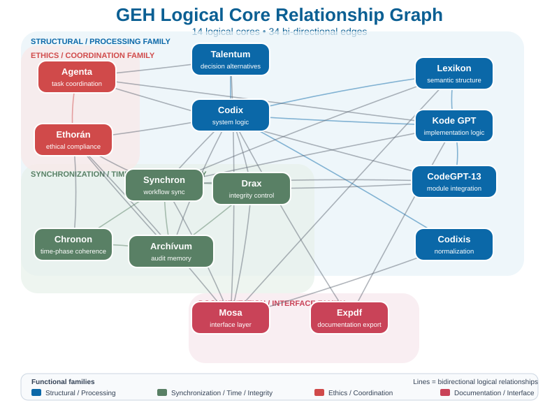

# GEH / AI Workflow & Validation Portfolio
## Nyilvános rendszerarchitektúra és kapcsolati áttekintés

**Verzió:** 1.0  
**Dátum:** 2026-09-24  
**Státusz:** Public Architecture Overview  
**Operátor:** Almási Andor

---

## 1. Cél

Ez a dokumentum a GEH / AI Workflow & Validation Portfolio nyilvánosan bemutatható rendszerarchitektúráját foglalja össze.

Célja, hogy egy külső fejlesztő, auditor vagy szakmai partner gyorsan át tudja tekinteni:

- a 14 logikai mag funkcionális szerepét;
- a 34 élű, kétirányú WIRE-kapcsolati gráfot;
- a Multi Szimultán Szinkron (MSS) 14×14 keresztvalidációs elvét;
- a neurális generálás, a külső validáció és az emberi döntési kontroll szétválasztását;
- egy lehetséges black-box integrációs felületet;
- valamint a validált és a még nem benchmarkolt műszaki állapotot.

A dokumentum nem implementációs specifikáció. Nem tartalmazza a belső súlyokat, küszöbértékeket, teljes szabálymátrixokat, promptstruktúrákat vagy a rendszer reprodukálásához szükséges know-how-t.

---

## 2. Magas szintű architektúra

A rendszer egyik központi elve:

**neurális generálás ≠ külső validáció ≠ emberi döntés**

Az AI-motorok jelölt válaszokat, elemzéseket és megoldási irányokat állíthatnak elő.  
A külső validációs réteg ezeket ellenőrzi, összeveti és szükség esetén újraértékelésre küldi.  
A végső döntési kontroll az operátornál marad.



---

## 3. A 14 logikai mag

A „logikai mag” ebben a dokumentumban szerepalapú logikai és munkafolyamat-funkciót jelent.

| Logikai mag | Rövid funkcionális szerep |
|---|---|
| **Talentum** | döntési alternatívák és megoldási struktúrák |
| **Codix** | rendszerlogika, szerkezeti és konzisztenciavizsgálat |
| **Lexikon** | szemantikai és tudásstruktúrák |
| **Codixis** | normalizáció és peremillesztés |
| **Kode GPT** | implementációs és transzformációs logika |
| **CodeGPT-13** | modul-összeállítás és integráció |
| **Synchron** | állapot- és munkafolyamat-szinkronizáció |
| **Chronon** | idő- és fáziskoherencia |
| **Drax** | integritási és védelmi kontroll |
| **Archívum** | állapot-, verzió-, bizonyíték- és auditmegőrzés |
| **Ethorán** | etikai és működési keretmegfelelés |
| **Agenta** | feladat- és munkafolyamat-koordináció |
| **Expdf** | dokumentációs és exportfunkció |
| **Mosa** | interfész-, relációs és megjelenítési réteg |

**Történeti megjegyzés:** Chronon a rendszer későbbi fejlődési szakaszában jelent meg külön logikai magként, szoros funkcionális kapcsolatban Synchronnal. Korábbi gráfokban ezért nem minden esetben szerepel külön csomópontként.

---

## 4. WIRE kapcsolati gráf

A későbbi, ellenőrzött rendszerállapot:

- **14 logikai mag**
- **34 egyedi, kétirányú él**

A Codixis végleges fokszáma **2**: kapcsolódik **Codixhoz** és **Mosához**. A korábbi „egyetlen kapcsolata” megjegyzés elavult állapotból származik.

<details>
<summary><strong>A 34 rögzített kétirányú él</strong></summary>

1. Talentum ↔ Codix  
2. Talentum ↔ Agenta  
3. Talentum ↔ Mosa  
4. Codix ↔ Lexikon  
5. Codix ↔ Codixis  
6. Codix ↔ Synchron  
7. Codix ↔ Drax  
8. Codix ↔ Archívum  
9. Codix ↔ Ethorán  
10. Codix ↔ Expdf  
11. Codix ↔ Kode GPT  
12. Lexikon ↔ Synchron  
13. Lexikon ↔ Mosa  
14. Lexikon ↔ Kode GPT  
15. Synchron ↔ Chronon  
16. Synchron ↔ Drax  
17. Synchron ↔ Archívum  
18. Synchron ↔ Ethorán  
19. Synchron ↔ Kode GPT  
20. Synchron ↔ CodeGPT-13  
21. Synchron ↔ Mosa  
22. Drax ↔ Archívum  
23. Drax ↔ CodeGPT-13  
24. Archívum ↔ Ethorán  
25. Archívum ↔ Chronon  
26. Ethorán ↔ Chronon  
27. Ethorán ↔ Agenta  
28. Kode GPT ↔ CodeGPT-13  
29. Kode GPT ↔ Agenta  
30. Kode GPT ↔ Expdf  
31. CodeGPT-13 ↔ Agenta  
32. Mosa ↔ Codixis  
33. Mosa ↔ Drax  
34. Mosa ↔ Ethorán  

</details>

A publikus dokumentum a topológiát bemutatja, de nem közli a belső kapcsolati súlyokat, aktiválási küszöböket vagy routing-feltételeket.

---

## 5. MSS — Multi Szimultán Szinkron

A WIRE-gráf és az MSS két külön réteg.

A **WIRE** a stabil funkcionális kapcsolatokat írja le.  
Az **MSS** egy 14×14 keresztvalidációs és újraszinkronizációs működési elv.

A 14×14 jelölés nem 196 állandó fizikai élt jelent, hanem egy olyan ellenőrzési teret, amelyben a 14 mag releváns állapotai és kimenetei kölcsönösen összevethetők.

Eltérés esetén a rendszer célzott újraellenőrzést indíthat a problémához releváns kompetenciájú magok bevonásával, majd a korrigált eredményt visszavezeti a közös validációs állapotba.

Ez nem egyszerű többségi szavazás: a magok eltérő funkcionális szerepet képviselnek.

A publikus leírás szándékosan nem tartalmazza a magcsoport-kiválasztás teljes belső szabályrendszerét.

---

## 6. Munkafolyamat röviden

1. **Feladatbevitel** — az operátor meghatározza a célt, kontextust, bizonyítékokat és korlátokat.  
2. **Strukturálás** — a releváns funkcionális magok rendezik a fogalmakat, forrásokat és feldolgozási keretet.  
3. **Jelölt eredmény** — egy vagy több AI-motor megoldási jelöltet állít elő.  
4. **Keresztvalidáció** — a rendszer vizsgálja a feladattartást, kontextust, forráskapcsolatot, szerkezetet, logikai eltéréseket, integritást és működési korlátokat.  
5. **Eltéréskezelés** — szükség esetén célzott újraellenőrzés, korrekció, REVIEW vagy ABSTAIN történik.  
6. **Human-in-the-Loop** — kritikus eredmény csak operátori kontroll mellett lép tovább.  
7. **Audit** — a releváns állapotok és eredmények verzióhoz vagy hashhez köthetők.

---

## 7. Koncepcionális Black-Box Interface

Az alábbi séma kizárólag nyilvános, illusztratív integrációs példa.

### Példa bemenet

```json
{
  "request_id": "REQ-DEMO-001",
  "task_scope": "technical_validation",
  "operator_constraints": [
    "preserve_source_values",
    "flag_unverified_assumptions"
  ],
  "evidence_refs": [
    "SOURCE-A",
    "SOURCE-B"
  ],
  "candidate_output": "AI output to be validated"
}
```

### Példa kimenet

```json
{
  "request_id": "REQ-DEMO-001",
  "validation_state": "REVIEW_REQUIRED",
  "findings": [
    {
      "type": "source_discrepancy",
      "severity": "significant",
      "reference": "SOURCE-A"
    }
  ],
  "human_review_required": true,
  "execution_released": false
}
```

A mezőnevek illusztratívak, nem dokumentálnak produkciós API-sémát.

---

## 8. Validációs állapot

A portfólióban több külön referencia-artefaktumhoz tartozik reprodukált teszt- és integritási eredmény. A részletes verziók, hash-ek és futási eredmények a [VALIDATION_MANIFEST.md](./VALIDATION_MANIFEST.md) dokumentumban találhatók.

A jelen nyilvános bizonyítékréteg elsősorban:

- regressziós stabilitást;
- integritást;
- auditálhatóságot;
- eltérésfelismerést;
- reprodukálhatóságot;
- és emberi döntési kontrollt

vizsgál.

---

## 9. Teljesítmény és benchmark

Jelenleg nincs egységes referencia-környezetben publikált:

- latency p50 / p95 / p99;
- throughput;
- token-overhead;
- memóriahasználat;
- CPU/GPU terhelési profil;
- nagy terheléses skálázási görbe.

Ezért a repository nem közöl becsült teljesítményértékeket tényleges mérési adatként.

Későbbi benchmark csak rögzített hardver-, runtime-, modell- és tesztkörnyezet mellett tekinthető összehasonlíthatónak és auditálhatónak.

---

## 10. Nyilvános és védett réteg

### Nyilvánosan bemutatható

- a 14 logikai mag neve és funkcionális szerepe;
- a 34 élű kapcsolati gráf;
- az MSS magas szintű működési elve;
- validációs módszertan;
- reprodukált teszteredmények és hash-azonosítók;
- illusztratív black-box interfész;
- Human-in-the-Loop elv.

### Nem nyilvános

- teljes szabálymátrix;
- kapcsolati súlyok;
- aktiválási küszöbök;
- belső routing- és kiválasztási logika;
- döntési képletek;
- működési promptok;
- teljes etikai szabálystruktúra;
- reprodukálható implementációs know-how.

---

## 11. Értelmezési korlátok

- A 14×14 MSS önmagában nem bizonyít teljes rendszerszintű hibamentességet vagy „No Single Point of Failure” garanciát.
- A helyreállítási logika nem jelent univerzális önjavítási garanciát.
- A PASS tesztek nem bizonyítanak minden lehetséges bemenetre hibamentességet.
- A hash integritást bizonyít, nem önmagában szemantikai helyességet.
- A többmotoros egyezés erős ellenőrzési jel, de nem helyettesíti az eredeti bizonyítékot.

---

## 12. Kapcsolódó dokumentáció

- [Validation Manifest](./VALIDATION_MANIFEST.md)
- [GEH-Core nyilvános összefoglaló](../portfolio/GEH_CORE_PUBLIC_OVERVIEW_HU.md)
- [GEH-Core kutatási háttér](./GEH_CORE_RESEARCH_CONTEXT_HU.md)
- [VDA-01 nyilvános összefoglaló](../portfolio/VDA01_PUBLIC_OVERVIEW_HU.md)
- [Magyar portfólió](../portfolio/PORTFOLIO_MASTER_HU.md)

---

> **Az AI-kimenet ne pusztán meggyőző legyen, hanem legyen ellenőrizhető, visszakövethető, újraértékelhető és emberi kontroll alatt tartható.**
